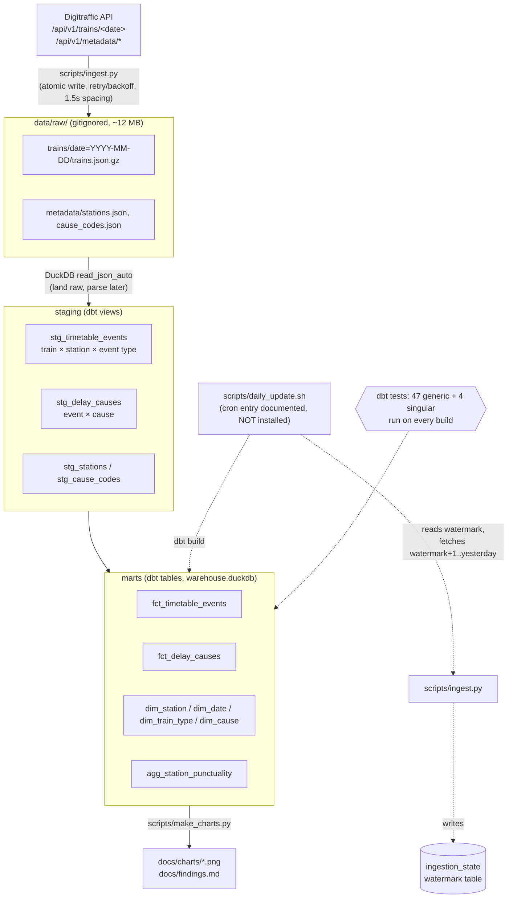
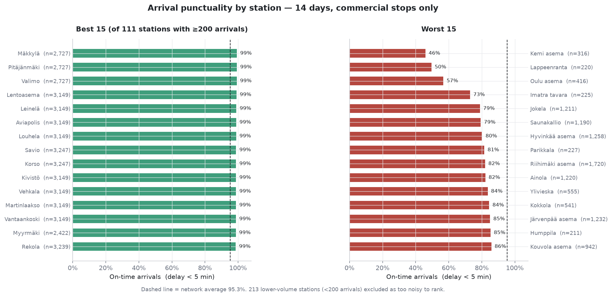
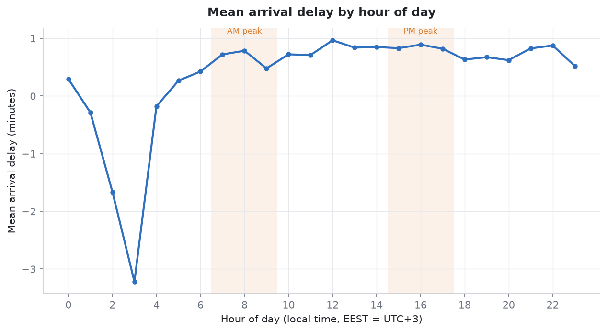
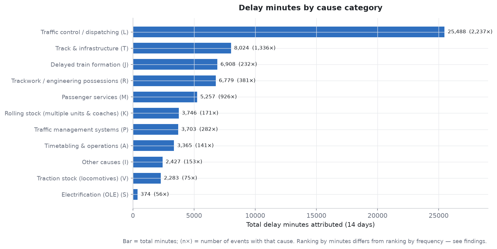
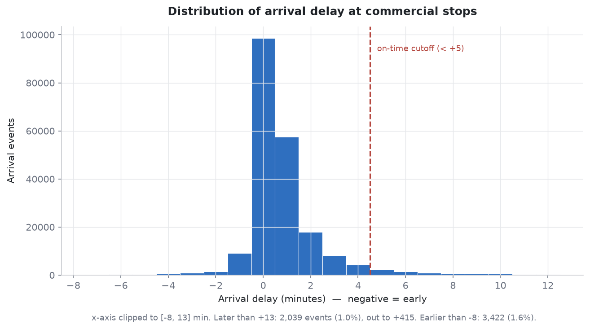
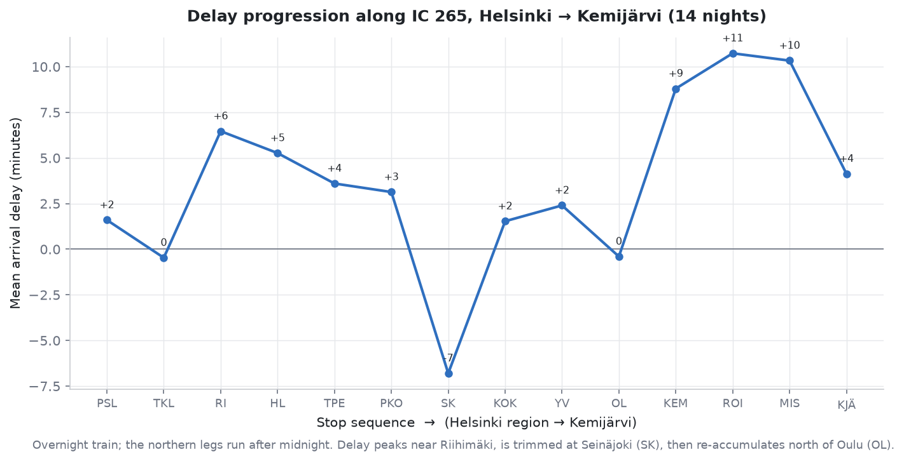
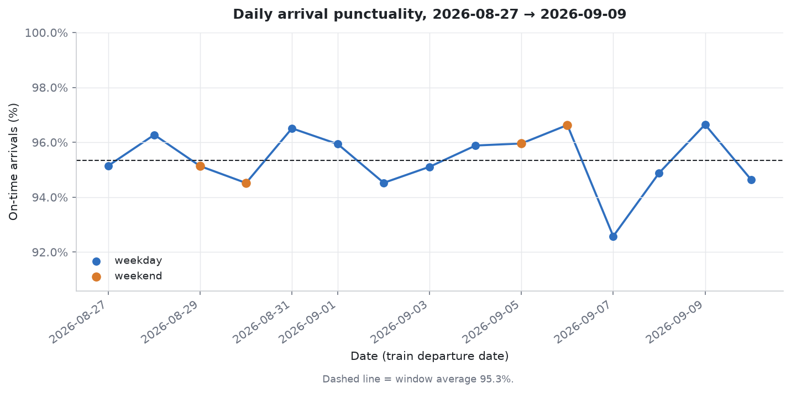
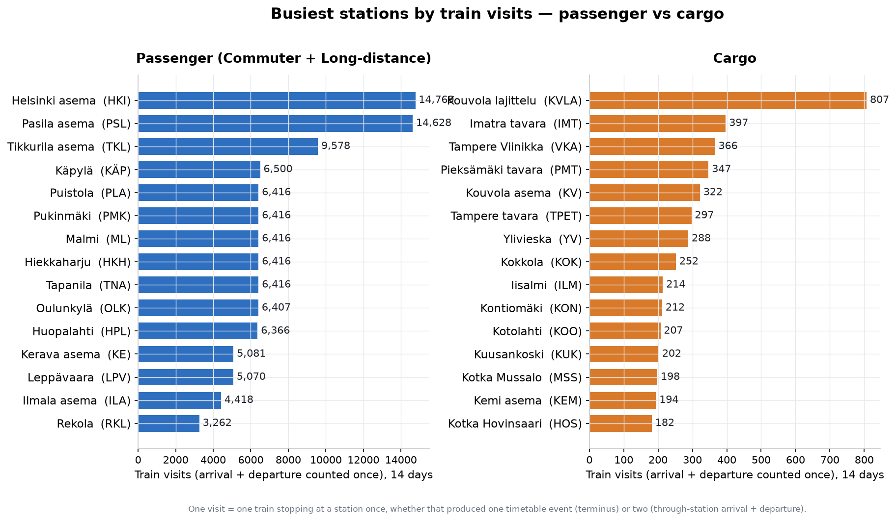

# Finnish railway traffic & punctuality — a local ELT pipeline

A local ELT pipeline over 14 days of Finnish railway traffic from the
**Fintraffic / Digitraffic** open API (`https://rata.digitraffic.fi`) — data
source and **licence: CC-BY 4.0**. Raw JSON is
landed to disk, flattened into a DuckDB star schema with dbt, tested, refreshed
by a catch-up-aware update script, and analysed into the charts below.

Stack: Python venv · `duckdb` · `dbt-core` + `dbt-duckdb` · `requests` ·
`matplotlib` · `cron` (documented, not installed) · `git`. No cloud, no Docker,
no paid services.

**Nothing runs on a schedule.** New days of data are only fetched, and the
analysis only refreshed, when a person runs `bash scripts/daily_update.sh`
(Git Bash on Windows) — it pulls any new dates and then regenerates
`docs/findings.md` and every chart in `docs/charts/` to match. See
[Ingestion and scheduling](#ingestion-and-scheduling) below.

---


## Data quality

Measured in Stage 1 ([docs/data_profile.md](docs/data_profile.md)) over 932,094
timetable events across 14 days:

| issue | count | covered by |
|---|---|---|
| `actual_time` NULL | 62,275 (6.7%) — cancelled rows, last-day not-yet-run, pass-by points | `has_actual_time` flag; excluded from every delay aggregate |
| Cancelled trains | 1,266 (5.5%) / 31,512 events | `is_cancelled` flag; `assert_event_count_matches_staging` (they stay in the fact) |
| `actual_time` before `scheduled_time` by > 60 min at a commercial stop | 528 events (freight with a revised path) | `assert_actual_not_before_scheduled_beyond_tolerance` (severity `warn`); `is_plausible_delay = false` |
| `delay_minutes` outside [−60, +1440] | 5,525 (0.6%), all below −60, down to −286 | `assert_delay_within_plausible_range` (severity `warn`); `is_plausible_delay = false` |
| `(departure_date, train_number)` not guaranteed unique | 0 collisions in this window, but not relied on | `event_key` includes station + event type + scheduled time; `unique` test on `stg_timetable_events` and `fct_timetable_events` |
| Timetable station codes missing from metadata | **0** | `dim_station` unknown member (`-1`); `assert_no_orphan_stations` (PASS) |
| Trains spanning two calendar dates | 561 trains / 35,976 events | keyed on `departure_date` throughout |
| Multi-cause events | 0 in window (schema allows N) | `fct_delay_causes` built at event-cause grain regardless |

`dbt build` result: **57 pass, 2 warn (the two above, deliberately), 0 errors.**

---

## Findings

Full version with every number: [docs/findings.md](docs/findings.md). Highlights:

- **Network on-time rate: 95.4%** (arrival delay < 5 min at a commercial stop,
  over 197,992 realised arrivals). Mean arrival delay **+0.68 min**.
- **Commuter vs long-distance: 97.0% vs 85.9%** on time. Long-distance trains
  cross hundreds of km of partly single-track line where one conflict propagates
  for the rest of the run; commuter trains recover between dense stops.
- **Delay accumulates *and* recovers along a route.** On IC 265 the schedule
  claws back a 7-minute delay at Seinäjoki, then the sparse network north of Oulu
  lets it rebuild to ~9 minutes — there is nowhere to catch up once past Oulu.
- **The most frequent delay code is "running early"** (`E` / *Etuajassakulku*,
  3,431 of 9,024 coded events) and it contributes zero delay minutes by
  definition. That is why the cause ranking by frequency differs from the ranking
  by attributed minutes — and `J` (delayed train formation) is rare but averages
  ~30 min each, so it climbs the minutes ranking.
- **Weekends are not more punctual** (95.5% vs 95.4%) despite far fewer trains —
  congestion is not the binding constraint on this network in this window.
- **Cause attribution is sparse:** only 1.0% of all timetable events carry a
  cause code (~4% of events delayed 5 min or more). Cause analysis describes
  *reported* causes, not all delay.

---

## Architecture



---

## Data model

A **fact table** holds one row per real-world event with measurable numbers (a
timetable stop, a delay cause); a **dimension table** holds descriptive lookups
you join against (station names, dates, train types). "Star schema" = a small
number of fact tables surrounded by dimension tables. Grain of every mart table:

| table | grain | one sentence |
|---|---|---|
| `fct_timetable_events` | one row per **train × station × event type** (ARRIVAL or DEPARTURE) | every scheduled timetable event — whether or not the train actually stops there — nothing filtered; cancelled / pass-by / no-actual-time rows are kept and flagged |
| `fct_delay_causes` | one row per **event × cause** | the `causes` array unnested, held apart from the event fact |
| `dim_station` | one row per station (+ unknown member `-1`) | short code, name, coordinates, passenger-traffic flag |
| `dim_date` | one row per calendar date in the loaded range | `date_key`, weekday/weekend, month, week-of-year |
| `dim_train_type` | one row per observed `(train_type, train_category)` | with `is_long_distance` / `is_commuter` helper flags |
| `dim_cause` | one row per delay cause category code (+ unknown member `-1`) | code + Finnish name |
| `agg_station_punctuality` | one row per **station × date** | scheduled/measured/on-time arrival counts, on-time rate, avg/median/worst delay |

**Why delay causes are a separate fact table.** `fct_delay_causes` is at a finer
grain than `fct_timetable_events` (an event can carry several causes; the API
schema allows it, though no event in this 14-day window has more than one). If
these rows were columns on the event fact they would need either N sparse cause
columns or a join that fans the event fact out by N and multiplies every additive
measure. A conformed sub-fact at the event-cause grain is the standard
resolution; join it back on `event_key` and split the event's delay across its
cause rows. The `assert_event_count_matches_staging` test exists to catch exactly
this fan-out.

---

## Modeling decisions

Each non-obvious decision, why, and the rejected alternative.

| decision | choice | why | rejected |
|---|---|---|---|
| **Event grain** | one row per train × station × ARRIVAL/DEPARTURE | matches the source `timeTableRows` element; lets delay be measured at every point, arrival and departure separately | train grain — loses per-station delay, can't trace a route |
| **On-time threshold** | arrival delay **< 5 min** at commercial stops, applied uniformly | Finnish long-distance convention; a single threshold keeps the metric comparable across the network | the 3-min commuter rule — needs per-category logic for marginal benefit on 14 days; documented in `dbt_project.yml` as a var so it's one line to change |
| **Cancelled trains** (1,266 trains / 31,512 events) | kept in `fct_timetable_events`, flagged `is_cancelled`, excluded from punctuality metrics | a cancellation is a fact about the day; dropping it hides ~5.5% of scheduled service | drop entirely — loses cancellation analysis |
| **Null `actual_time`** (62,275 events, 6.7%) | kept, flagged `has_actual_time = false`, excluded from delay aggregates | mostly cancelled rows, not-yet-run events on the last day, and pass-by points with no recorded actual — all legitimately part of the schedule | drop — silently shrinks the event fact and breaks the count-matches-staging test |
| **Pass-by / non-stopping rows** (~20% of events) | kept in the fact, flagged `is_stopping = false`; punctuality aggregates filter to `is_commercial_stop` | needed to trace delay between booked stops (Q5); the flag keeps them out of passenger-facing metrics | fact = booked stops only — loses the propagation view |
| **Midnight-crossing trains** (561 trains, 35,976 events on a different calendar date) | everything keyed on `departure_date`, not the wall-clock date of each event | `departure_date` is stable and is how the API partitions a train; an overnight train is one train | key on event date — splits a train across two `dim_date` rows |
| **Multi-cause attribution** | modelled at event-cause grain in `fct_delay_causes`; equal split when attributing minutes | correct model, future-proof; 0 multi-cause events in this window so no split is actually needed yet | a single `cause_code` column on the event fact — wrong grain, caps at one cause |
| **Surrogate key** | `event_key` = md5 hash (a fixed-length fingerprint of some input text — same input always gives the same key) of (departure_date, train_number, station_short_code, event_type, scheduled_time) | `(departure_date, train_number)` is not API-guaranteed unique, and a train can call at one station twice (reversals) — `scheduled_time` disambiguates | hash of train + station only — collides on reversals; verified unique before anything downstream relies on it |
| **Implausible delays** (−286 to +477 min observed) | kept, flagged `is_plausible_delay = false` outside [−60, +1440] min; delay aggregates filter on the flag | the values are real API output (freight with a revised schedule version); flagging beats deleting | drop — loses the data-quality signal; the two singular tests warn on the counts every run |

---

## Ingestion and scheduling

Full field-by-field version: [docs/scheduling.md](docs/scheduling.md).

- **Watermark.** `ingestion_state` (a table in `warehouse.duckdb`) holds one row
  per successfully ingested date. `scripts/ingest.py` writes the row only *after*
  the response is landed to disk **and** validated as a non-empty JSON array; a
  failed / empty / malformed response leaves the watermark alone and exits
  non-zero.
- **Catch-up.** `scripts/daily_update.sh` reads `max(date)` from the watermark
  and fetches **every** date from `watermark + 1` through yesterday — not just
  yesterday. A laptop off Friday–Monday fetches all three missed days on its next
  run. Re-fetching is idempotent (atomic raw writes + full model rebuilds);
  verified by rewinding the watermark 3 days and confirming identical row counts
  with zero `event_key` duplicates.
- **The analysis refreshes too.** After `dbt build`, `daily_update.sh` also runs
  `scripts/make_charts.py`, so `docs/findings.md` and every PNG in `docs/charts/`
  are regenerated off whatever the warehouse holds *every time the script runs*
  — including a day with nothing new to fetch. You can also run
  `python scripts/make_charts.py` on its own at any point to refresh the write-up
  from the current warehouse without touching ingestion. Note this means
  `docs/findings.md` is a live snapshot, not a fixed record — the exact numbers
  quoted in this README were captured from one specific run and will drift
  slightly from `docs/findings.md` as more days accumulate.
- **The cron entry — documented, NOT installed:**

  ```
  0 6 * * * /full/path/to/rail-pipeline/scripts/daily_update.sh >> /full/path/to/rail-pipeline/logs/cron.log 2>&1
  ```

  | field | value | meaning |
  |---|---|---|
  | minute | `0` | at minute 0 |
  | hour | `6` | of hour 06 (a full night of `actualTime` has settled for the previous service day) |
  | day of month | `*` | every day |
  | month | `*` | every month |
  | day of week | `*` | every weekday |

  `>> …/cron.log 2>&1` appends stdout+stderr (cron has no terminal). **Nothing
  was added to any crontab or scheduler** — the script is run by hand.
- **Laptop-must-be-on caveat (if it *were* installed).** `cron` only fires while
  the machine is awake and does not itself replay missed runs. A 06:00 job on a
  closed laptop simply doesn't run that day. The catch-up logic is the
  mitigation: the next run pulls everything back to the watermark.
- **macOS:** `/usr/sbin/cron` needs Full Disk Access, or `launchd`
  (`StartCalendarInterval`) is the native alternative. **Windows** has no cron;
  Task Scheduler invoking `bash.exe scripts/daily_update.sh` is the equivalent.
- **Verify a run:** `tail logs/daily.log` — one line per run ending `PASS` or
  `FAIL`. **Test without waiting for 06:00:** run `bash scripts/daily_update.sh`
  directly and check `echo $?`.

---

## The charts

### 1. Arrival punctuality by station

*Inner commuter stations run ~99% on time; the worst are far-north long-distance
stops (Kemi 46%, Oulu 56%) and outer-commuter stations on the congested
Helsinki–Riihimäki main line. 212 low-volume stations are excluded as too noisy
to rank over 14 days.*

### 2. Mean arrival delay by hour of day

*Delay builds gently through the operating day — from ~0.3 min at 05:00 to ~1.0
min around midday — then eases in the evening. The swing is under a minute
because punctual commuter trains dominate the counts.*

### 3. Delay minutes by cause category

*Traffic control / dispatching (`L`) accounts for far more delay minutes than
anything else. Ranking by minutes ≠ ranking by frequency (see findings).*

### 4. Distribution of arrival delay

*Sharply peaked at zero: median 0 min, 95th percentile +4 min. A thin right tail
(1.0% of arrivals) runs past +13 min, out to +415. Finnish rail is "usually
exactly on time, occasionally very late".*

### 5. Delay progression along IC 265 (Helsinki → Kemijärvi)

*Delay both accumulates and is recovered: it builds to ~7 min by Riihimäki, is
over-corrected at Seinäjoki (6 min early), then re-accumulates to ~9 min through
the single-track sections north of Oulu.*

### 6. Daily arrival punctuality, 2026-08-27 → 2026-09-09

*Stable around the 95.4% average. Monday 2026-09-07 dipped to 92.6%; weekends
(orange) sit right on the average — no weekend punctuality bonus despite ~25%
fewer trains.*

### 7. Busiest stations by train visits — passenger vs cargo

*Counts one train stopping at a
station as one visit, regardless of whether that produced one timetable event
(a terminus) or two (a through-station's arrival + departure) — the naive
event count made Pasila look ~2× busier than Helsinki for exactly that reason;
by visits they're nearly tied (14,769 vs 14,628). Busiest cargo station is the
Kouvola marshalling yard (807 visits), well ahead of any other freight point.*

---
## How to run it

From a clean checkout (macOS/Linux; on Windows use Git Bash and `.venv/Scripts`):

```bash
# 1. environment
python -m venv .venv
source .venv/bin/activate            # Windows: source .venv/Scripts/activate
pip install -r requirements.txt      # duckdb, dbt-core, dbt-duckdb, requests, matplotlib

# 2. backfill 14 days ending yesterday  (~1 min, ~12 MB on disk)
python scripts/ingest.py --start "$(date -d '14 days ago' +%F)" --end "$(date -d 'yesterday' +%F)"

# 3. profile the raw data  ->  docs/data_profile.md
python scripts/profile_raw.py

# 4. build + test the star schema   (run from the rail/ directory)
cd rail && dbt build --profiles-dir . && cd ..

# 5. analysis + charts  ->  docs/findings.md, docs/charts/*.png
python scripts/make_charts.py

# thereafter: incremental catch-up + rebuild
bash scripts/daily_update.sh
```

`dbt debug --profiles-dir .` (from `rail/`) checks the connection.

---

## What I would change at scale

- **Warehouse / engine.** DuckDB on a laptop → a cloud warehouse (BigQuery,
  Snowflake) or a distributed engine (Spark, Trino) once the raw layer is years
  of data rather than 14 days.
- **Orchestration.** `cron` + a shell script → a real orchestrator (Airflow,
  Dagster) with retries, backfill DAGs, SLAs, alerting, and lineage.
- **Raw layer.** Gzipped JSON files → an open table format (Iceberg, Delta) with
  schema evolution, partition pruning, and time travel over the landed data.
- **Backfill.** Sequential date-by-date fetch → partition-level parallel
  backfills with a work queue and rate limiting.
- **Contracts.** The `_sources.yml` shape assumptions → enforced data contracts
  on the API response, versioned, with CI that fails on drift.
- **Cost.** Add per-model cost attribution and storage/compute budgets once the
  warehouse is metered.

## What this does not cover

Cloud infrastructure and IAM; concurrency and multi-writer coordination;
streaming / near-real-time ingestion (the API also offers a live feed);
multi-team data governance, access control, and a semantic layer; CI/CD for the
dbt project; alerting and on-call.

---

Personal build notes, separate from the project deliverable:
[docs/what_i_learned.md](docs/what_i_learned.md).
